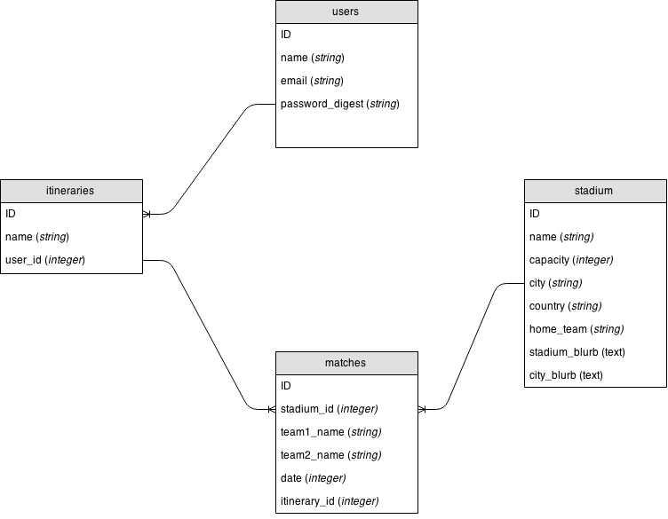

#Traveling football fan
##Application description

Lorem ipsum dolor sit amet, consectetur adipisicing elit, sed do eiusmod tempor incididunt ut labore et dolore magna aliqua. Ut enim ad minim veniam, quis nostrud exercitation ullamco laboris nisi ut aliquip ex ea commodo consequat. Duis aute irure dolor in reprehenderit in voluptate velit esse cillum dolore eu fugiat nulla pariatur. Excepteur sint occaecat cupidatat non proident, sunt in culpa qui officia deserunt mollit anim id est laborum.

##Team members
+ Efosa Osamwonyi
+ Mike Stokes
+ Bobby Lopez  

##Technology used
+ Ruby on Rails
+ JQuery Ajax
+ Postgresql - database
+ HTML & CSS
+ Draw.io - ERD
+ Moqups.com - Wireframes

##Trello board
<a href="https://trello.com/b/tYYOSPAQ/project-3-bulbasaur">Bulbasaur Trello board</a>

##Artifacts
###Wireframes
<<<<<<< HEAD
###ERDs
#### Users table
|id   | email  |password   |
|---|---|---|
| 1  | efosa@gmail.com  |squirtle   |
| 2  | mike@gmail.com  | charmander  |
| 3  | bobby@gmail.com  | mewtwo |
=======
###ERD

>>>>>>> 3ff69ed60ddcda2ab598b7e0b14e20e7e9b0a15f

#### Itenaries table
|id   |name   |user_id   |
|---|---|---|---|
|1   |Madrid-Real Madrid  | 1  |
|2   |Barcelona-Camp Nou   |2   |
|3   |Madrid-Athletico Madrid   |3   |
#### Matches table
|id|team1_name   | team2_name  | date  |itenaries_id|
|---|---|---|---|---|
|1| Manchester United  | Chelsea  |05/01/2015   |4
|2|  Barcelona |Real Madrid   | 05/02/2015  |2
|3| Bayern Munich  | Manchester city  |05/04/2015   |5

<<<<<<< HEAD
=======
#### Users table
|id   | email  |password_digest   |
|---|---|---|
| 1  | efosa@gmail.com  |squirtle   |
| 2  | mike@gmail.com  | charmander  |
| 3  | bobby@gmail.com  | mewtwo |
>>>>>>> 3ff69ed60ddcda2ab598b7e0b14e20e7e9b0a15f
####Stadiums table
|id| name  |capacity   |city   | country  | home_team|
|---|---|---|---|---|---|
|1|Camp Nou   | 99,786  | Barcelona  | Spain  | FC Barcelona|
|2|Old Trafford   | 75,731  | Manchester  | England  |Manchester United FC|
